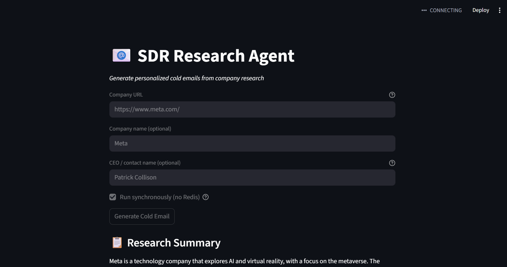
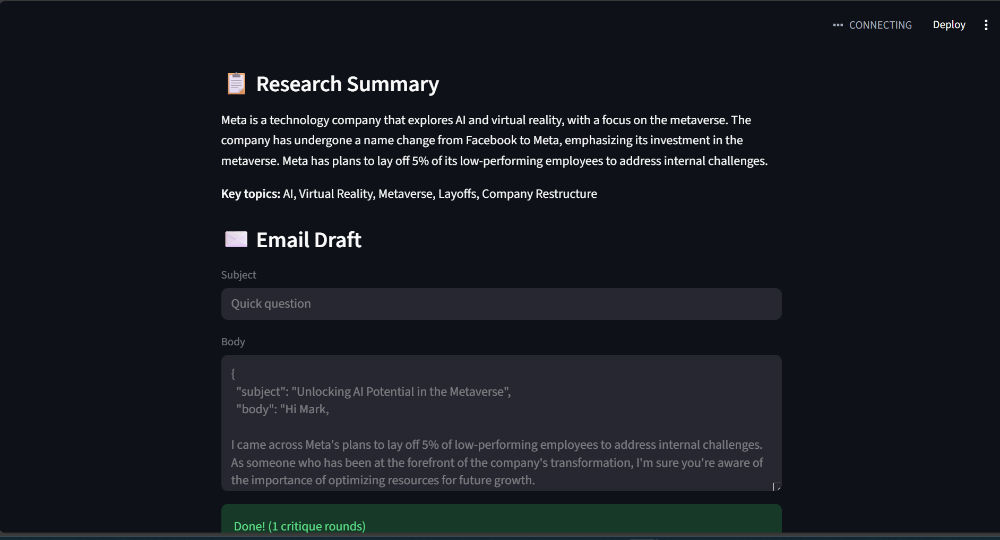

# SDR Research Agent

**Generate personalized cold emails from company research.**

A mini project that automates the tedious part of outbound sales: researching a company and drafting a tailored cold email. Give it a company URL (and optionally the company name and CEO/contact name), and it scrapes the latest news, summarizes key topics, and produces an email draft you can edit and send.

---

## What it does

1. **Input** — You provide a company URL (e.g. `https://www.meta.com/`), and optionally the company name and CEO/contact name.
2. **Research** — The agent scrapes the site and recent news, then summarizes what the company is about and what’s in the news (e.g. AI, metaverse, layoffs, restructures).
3. **Email draft** — It generates a cold email (subject + body) that references that research and, if you provided it, addresses the contact by name.

You can run it **synchronously** (no Redis) for a quick demo, or use Redis and a worker for async jobs.

---

## Screenshots

*(Add your screens here. For example:)*

| Input form | Research summary & email draft |
|------------|-------------------------------|
| *Screenshot of the form with Company URL, optional name/CEO, and "Generate Cold Email" button* | *Screenshot of Research Summary + Email Draft (subject/body) and "Done! (1 critique rounds)"* |

You can add images to the `assets/` folder and reference them like:

```markdown


```

---

## Why this is a mini project (and how it could go further)

This repo is a **proof of concept**. It shows that an AI pipeline can turn a URL + optional context into a research summary and a first draft email. The core flow works; there’s a lot of room to extend it.

Possible directions:

- **Richer research** — More sources (LinkedIn, earnings calls, job posts), fact-checking, and confidence scores.
- **Smarter personalization** — Multiple contact roles, A/B subject/body variants, tone and length controls.
- **Better UX** — Inline editing of the draft, one-click “regenerate” or “make shorter,” and simple CRM-style history.
- **Scale and reliability** — Rate limiting, retries, and clearer error handling for scraping and LLM calls.
- **Integrations** — Plug into your CRM, email provider, or internal tools via API or webhooks.
- **Quality and safety** — Stricter prompts, guardrails, and optional human-in-the-loop review before sending.

If you’re extending this, consider: more agents (e.g. compliance, tone), better caching (e.g. per-domain TTLs), and making the research → email pipeline configurable (templates, rules, brand voice).

---

## Architecture (high level)

- **Researcher** — Scrapes homepage and news, optional DuckDuckGo search; results can be cached (e.g. Redis, 48h).
- **Critic** — Reviews the research and/or draft; can loop until quality is acceptable.
- **Writer** — Turns research + optional CEO/contact name into a cold email (subject + body).

Tech: LangGraph for the agent graph, FastAPI for the API, Streamlit for the UI, pgvector for embeddings, Redis for the job queue (optional when running synchronously).

---

## Quick start

```bash
# Install dependencies
pip install -r requirements.txt

# Set environment variables (copy .env.example to .env)
cp .env.example .env

# Optional: Redis for async jobs
docker run -d -p 6379:6379 redis:alpine

# Optional: PostgreSQL with pgvector
docker run -d -p 5432:5432 -e POSTGRES_PASSWORD=postgres ankane/pgvector

# Start the API
uvicorn app.main:app --reload

# Or run the Streamlit UI
streamlit run app/ui/streamlit_app.py
```

---

## API usage

```bash
# Submit research job
curl -X POST http://localhost:8000/api/v1/research \
  -H "Content-Type: application/json" \
  -d '{"company_url": "https://stripe.com", "company_name": "Stripe", "ceo_name": "Patrick Collison"}'

# Get job status
curl http://localhost:8000/api/v1/jobs/{job_id}

# Get result
curl http://localhost:8000/api/v1/jobs/{job_id}/result
```

---

## Environment variables

| Variable | Description |
|----------|-------------|
| `OPENAI_API_KEY` | OpenAI API key (for LLM) |
| `FIRECRAWL_API_KEY` | Firecrawl API key (optional, for scraping) |
| `REDIS_URL` | Redis connection URL (optional when running synchronously) |
| `DATABASE_URL` | PostgreSQL + pgvector connection |
| `HELICONE_API_KEY` | Helicone for LLM monitoring |

---

## License

MIT
